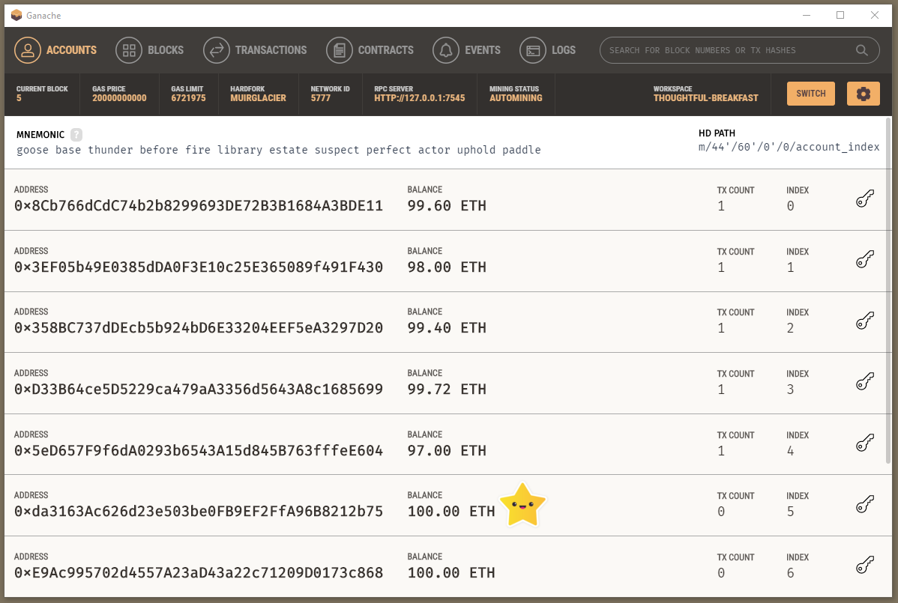
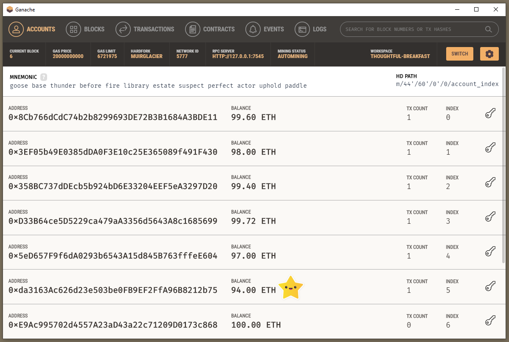
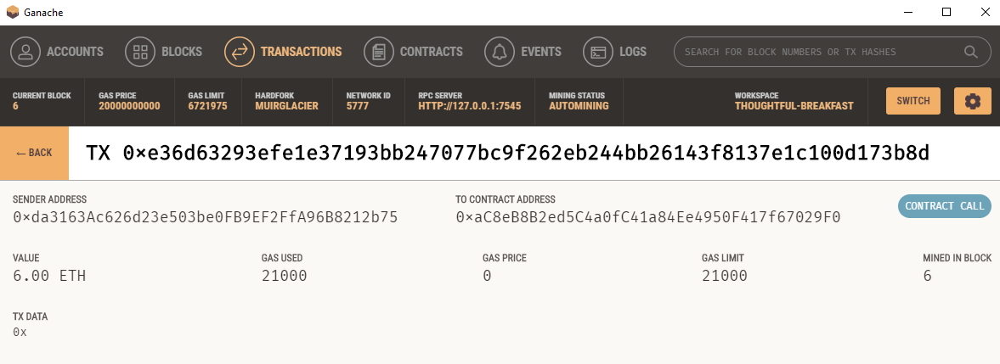
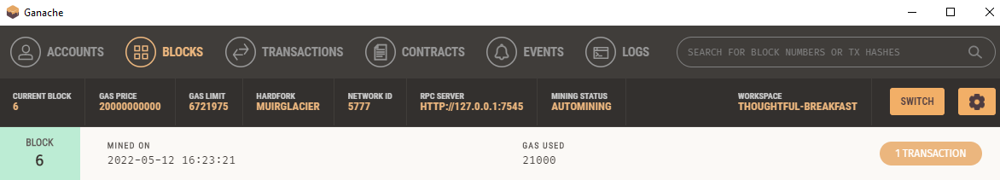
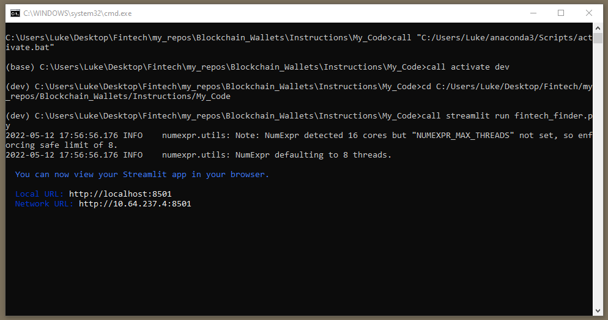

# Blockchain_Wallets

### Background

This project aims to incorporate the Ethereum blockchain network into an app so that customers can pay fintech specialists they hire with cryptocurrency instantly.

### Steps completed

* Import ethereum transaction functions into the fintech finder application
* Sign and execute a payment transaction
* Inspect the transaction on ganache

#### Fintech professional finder app

#### Ganache 

#### Ganache transaction 

#### Ganache block

#### Executable file launch

---