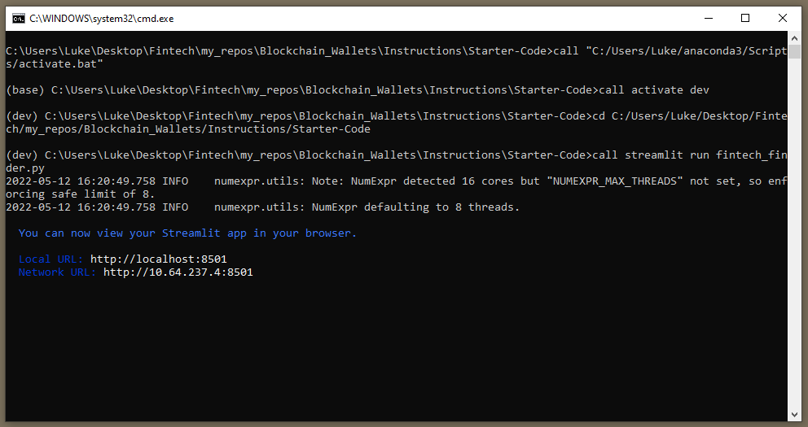
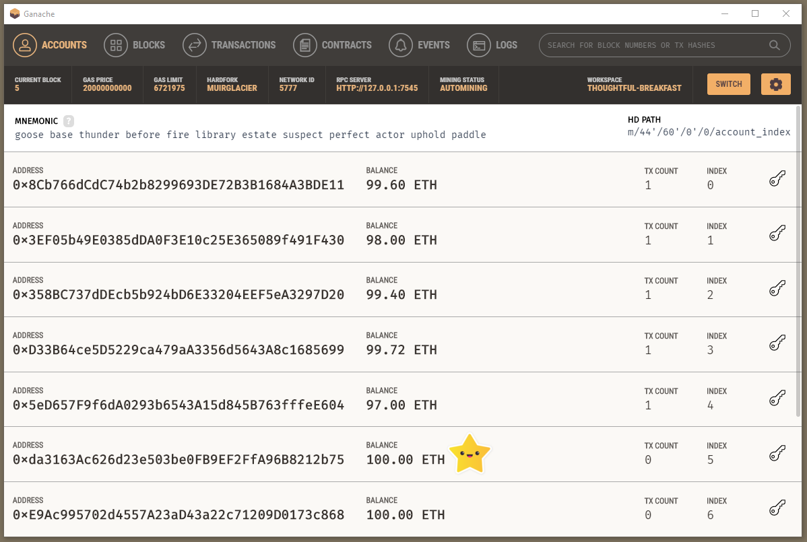
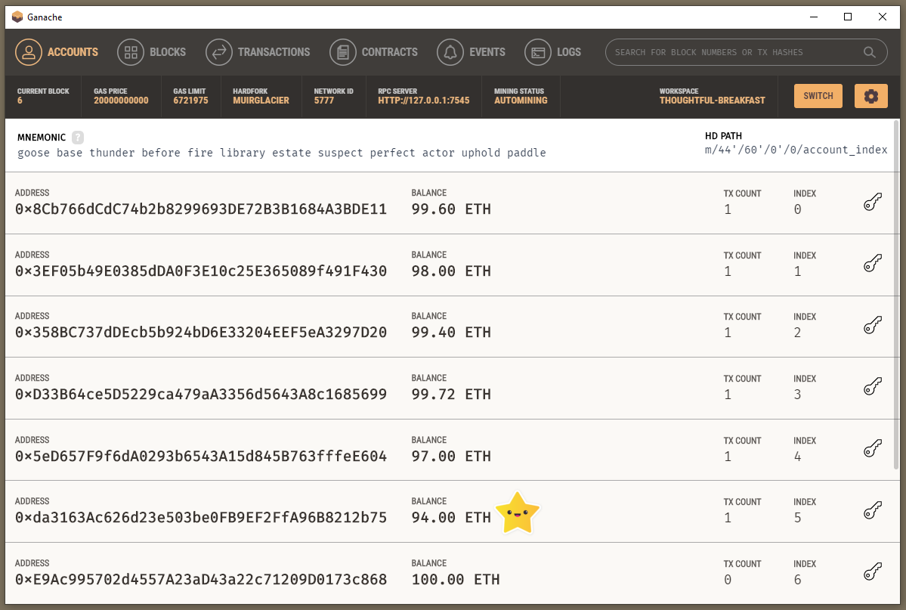
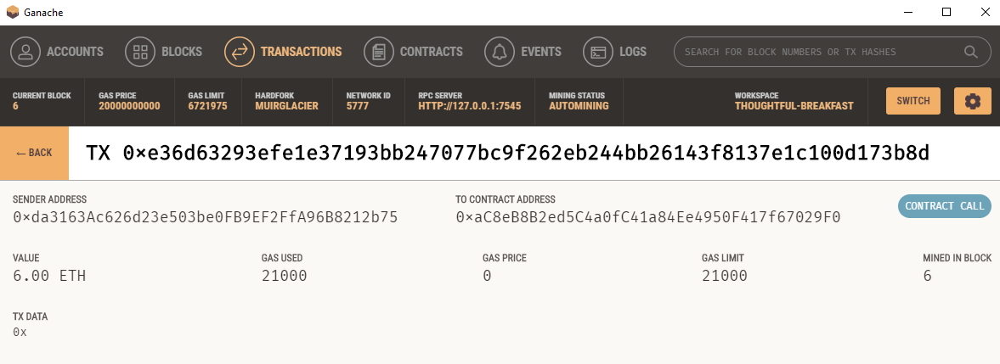
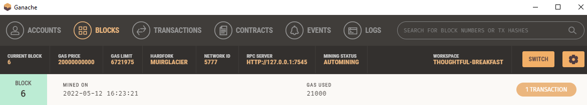

# Blockchain_Wallets

### Background

This project aims to incorporate the Ethereum blockchain network into an app so that customers can pay fintech specialists they hire with cryptocurrency instantly.

### Steps completed

* Import Ethereum Transaction Functions into the Fintech Finder Application
* Sign and Execute a Payment Transaction
* Inspect the Transaction on Ganache

#### Executable file launch

#### Fintech professional finder app

#### Ganache 

#### Ganache transaction 

#### Ganache block

---